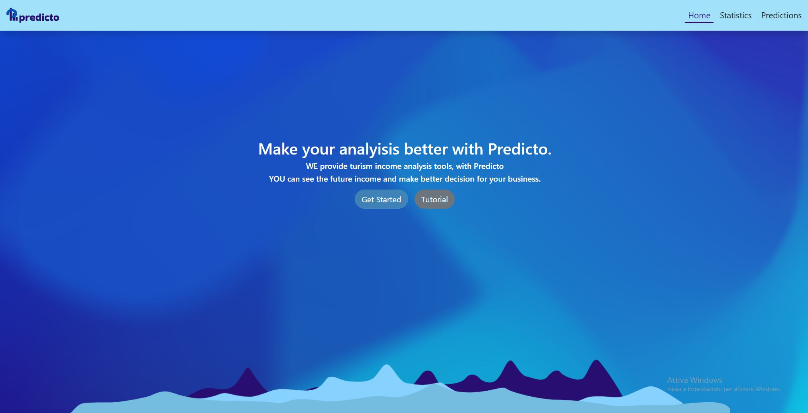

# Predicto

This web app provides tools to analyze tourism income datas in a specific City or Area.
Our datas refer to the Istat data source collected in the past years.
With our web app you can easly view data until 2008 and future data generated by python machine.

## Screenshots

# Predicto

## Demo link:
Access my site at [predicto.com](https://localhost)

## Table of Content:

- [About The App](#about-the-app)
- [Screenshots](#screenshots)
- [Technologies](#technologies)
- [Setup](#setup)
- [Approach](#approach)
- [Status](#status)
- [Credits](#credits)
- [License](#license)

## About The App
[Predicto] is an app that ...

## Screenshots

``

## Technologies
I used `html`, `css`, ...

## Setup
- download or clone the repository
- run `npm install`
- ...

## Approach
I adopted the `BEM` naming style for my css class names and ...

## Status
[name of project] is still in progress. `Version 2` will be out soon.

## Credits
List of contriubutors:
- [Nome]()

## License

MIT license @ [author](author.com)
